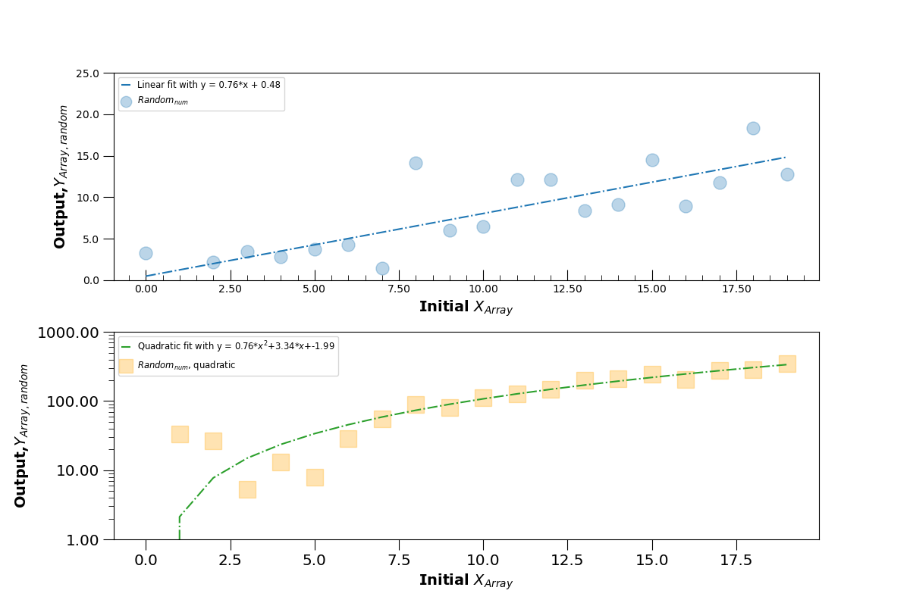
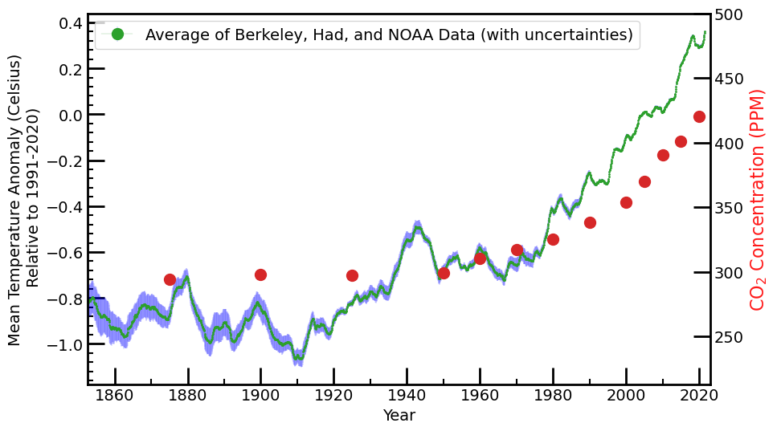

# _Python for Scientific Data Analysis_

## Homework #8 - Week 12 [INCOMPLETE] 
(_the full assignment will be due November 15_)

### 1. Project Update

* Please give me a **short** update on the progress of your class project.  In particular, I would like to see ...

- A description of the current status of your project
- Items where you are getting stuck (if any)/questions you may have
- Any plots or graphics you have produced beyond those from the previous homework.


### 2. Axis Formatting

 Start with the data arrays shown near the beginning of the part2a lecture notes along with their polynomial fits (second example plot):
 

 ```
from matplotlib import rcParams
rcParams['figure.figsize']=[12,8]
xarray=np.arange(20)   #an array of numbers from 0 to 19
yarray=np.arange(20)+3*np.random.randn(20)
 #y is same as x EXCEPT now we vary the value +/- some random number about x

a,b=np.polyfit(xarray,yarray,1)
 #a polynomial fit of degree one 

 #yarray2 again varied +/- about x but with different amount of 20*random_number
yarray2=(np.arange(20))**2.+20*np.random.randn(20)
 
 #polynomial of degree two
a2,b2,c2=np.polyfit(xarray,yarray2,2)

poly=np.poly1d(np.polyfit(xarray,yarray2,2))
 #a convenience class to write the polynomial fit

 #two rows, 1 column: i.e. the plots are vertically stacked
fig,axes=plt.subplots(2,1) 
 
 #first subplot
axes[0].plot(xarray,xarray*a+b,label='Linear fit with y = {0:.2f}*x + {1:.2f}'.format(a,b))
axes[0].scatter(xarray,yarray,marker='o',s=150,alpha=0.7,label=r'$Random_{num}$')
axes[0].legend(loc='best',fontsize='large')

 #second subplot
axes[1].plot(xarray,poly(xarray),c='tab:green',
  label=r'Quadratic fit with y = {0:.2f}*$x^2$+{1:.2f}*$x$+{2:.2f}'.format(a2,b2,c2))

axes[1].scatter(xarray,yarray2,marker='s',c='orange',s=50)
axes[1].legend(loc='best',fontsize='large')
 
 ```
 
 Just to be clear, this produces the following plot:
 
 
 
 **NOW ...**
 
 **Adjust this plot** using information from the Axis Limits, Scaling, and Formatting section and elsewhere to produce the following modified plot:
 
 
 
 
 
 Note the following things:
 
 * the axis labeling formats
 * tick formatting
 * scalings (linear or logarithmic)
 * spine thickness
 * transparency of the plotted points
 * linestyles
 * symbol sizes
 
 (also note that the exact points and functional fits will differ from mine since they are produced from random number generators)
 
 one note: with this revised plots, the y axis label on the second plot may run off the screen unless you resize the figure.  Doing the following allowed the label to appear for me:
 
 ```
 from matplotlib import rcParams
 rcParams['figure.figsize']=[12,8]
 ```

### 3. Secondary/Twin Axes

Most stellar spectra are plotted with x units of wavelength (because the numbers go from smaller to larger, left to right).   

Read in the following stellar atmosphere model 'lte9800-3.5-NextGen.fits.gz'.  The native units are wavelength (in microns) and flux density in $ergs/s/cm^{2}/A$.

Plot the x axis in both wavelength and frequency units as follows:

 
 
 

 
The following piece of code will get you started (note, you will need to install AstroPy for this to work (AstroPy will be discussed in mid November)

```
from astropy.io import fits


primary_model=fits.open('./lte9800-3.5.NextGen.fits.gz')
                    
phead=primary_model[0].header
primary_spec=primary_model[0].data

primary_spec.shape
##primary_wvlh=primary_spec[:,0]
#prim

primary_wvlh=primary_spec[0,:]
primary_flux=primary_spec[1,:]
```

### 4. Twin Axes

From pirates now to something slightly more serious ...

Start with the Co2 concentration and year arrays in the lecture notes to Matplotlib Part2c.  I.e.

```
#generating data for main axis
CO2concentration=np.array([289,288,291,295,294,298,297,299,310,317,325,338,354,370,390.1,401,420]) #roughly estimated from NOAA
CO2years=np.array([1700,1750,1800,1850,1875,1900,1925,1950,1960,1970,1980,1990,2000,2005,2010,2015,2020])
```

And now read in global mean temperature anomaly data from [https://climate.copernicus.eu/climate-indicators/temperature]()

You can read in the data as follows:

```
a=np.loadtxt('climate_data.txt')
```
The year is the first column; the Berkeley, Hadley Centre, and NOAA measurements are columns 2, 3, and 4.

Use twin axes to reproduce this plot



Here, the green line is the mean temperature anomaly from three separate measurements, blue is the standard deviation of these measurements.
 
### 5. TBD
 
 
### 6. TBD

